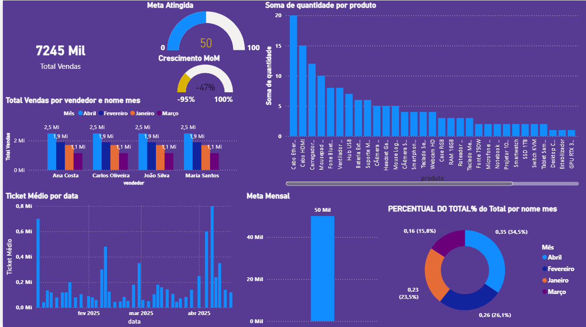

# venda-bi
Dashboard de vendas Power BI com análise completa de performance, regiões, produtos e vendedores.

## 📁 Estrutura do Projeto

```
venda-bi/
├── README.md                           # Este arquivo
├── dados/
│   └── vendas.csv                      # Base de dados de vendas (40+ registros)
├── modelos/
│   └── medidas_dax.txt                 # Medidas DAX para Power BI
└── documentacao/
    ├── guia_configuracao.md            # Guia passo-a-passo de setup
    └── especificacao_tecnica.md        # Especificações técnicas e arquitetura
```

## 🚀 Quick Start

### 1️⃣ Importar Dados
- Abra Power BI Desktop
- Selecione "Obter Dados" → "Texto/CSV"
- Escolha o arquivo `dados/vendas.csv`

### 2️⃣ Criar Medidas
- Copie todas as medidas de `modelos/medidas_dax.txt`
- Crie uma nova medida para cada uma no Power BI
- Cole o código DAX e confirme

### 3️⃣ Configurar Dashboard
- Siga o guia em `documentacao/guia_configuracao.md`
- Crie as 4 páginas principais recomendadas
- Configure segmentadores (slicers) para interatividade

## 📊 Páginas do Dashboard

### Página 1: Visão Geral
- Cartões KPI (Total Vendas, Quantidade, Ticket Médio, % Meta)
- Gráfico de linha: evolução de vendas
- Top 5 produtos
- Distribuição por região

### Página 2: Análise Regional
- Tabela com performance por região
- Gráfico de pizza: distribuição regional
- Ranking de vendedores por região

### Página 3: Análise de Produtos
- Vendas por categoria
- Produtos com melhor performance
- Análise quantidade vs valor

### Página 4: Performance de Vendedores
- Tabela com ranking de vendedores
- KPIs individuais
- Comparativo com média

## 📈 KPIs Principais

| Métrica | Descrição |
|---------|-----------|
| **Total Vendas** | Soma total de vendas em R$ |
| **Quantidade** | Total de unidades vendidas |
| **Ticket Médio** | Valor médio por venda |
| **Crescimento MoM** | Variação mês a mês em % |
| **% Meta** | Percentual de atingimento da meta |
| **Top Região** | Região com melhor performance |
| **Top Produto** | Produto mais vendido |

## 🔧 Tecnologias Utilizadas

- **Power BI Desktop** (Última versão recomendada)
- **DAX** para medidas e cálculos
- **M (Power Query)** para transformação de dados
- **CSV** como formato de dados

## 💾 Dados Inclusos

- **40 registros** de vendas de exemplo
- **5 regiões**: Sudeste, Norte, Nordeste, Sul, Centro-Oeste
- **4 vendedores**: João Silva, Maria Santos, Carlos Oliveira, Ana Costa
- **10+ categorias** de produtos
- **Período**: Janeiro a Abril de 2025

## 📚 Documentação

### Iniciantes
→ Leia `documentacao/guia_configuracao.md`

### Desenvolvedores/Analistas
→ Leia `documentacao/especificacao_tecnica.md`

## 🛠️ Customização

### Adicionar Dados Reais
1. Substitua o arquivo `dados/vendas.csv` pelos seus dados
2. Mantenha a mesma estrutura de colunas
3. Atualize o Power BI: "Transformar dados" → "Atualizar"

### Adicionar Novas Medidas
1. Abra `modelos/medidas_dax.txt`
2. Copie a medida desejada
3. No Power BI: "Nova Medida" → Cole o código

### Modificar Layout
- As páginas recomendadas são sugestões
- Adapte conforme sua necessidade
- Use as medidas DAX em qualquer visualização

## 📞 Suporte

Para dúvidas sobre:
- **Setup**: Ver `guia_configuracao.md`
- **Medidas DAX**: Ver `medidas_dax.txt` e `especificacao_tecnica.md`
- **Dados**: Verificar formato em `vendas.csv`

## 📝 Changelog

### v1.0 - Dezembro 2025
- ✅ Estrutura inicial do projeto
- ✅ Base de dados de exemplo
- ✅ 15+ medidas DAX prontas
- ✅ Documentação completa
- ✅ Guia de configuração

## 🎯 Próximos Passos

1. Integrar dados reais
2. Adicionar análise preditiva
3. Configurar alertas inteligentes
4. Publicar em Power BI Service
5. Criar app mobile

---

**Criado em**: Dezembro de 2025  
**Status**: ✅ Pronto para Uso  
**Versão**: 1.0

